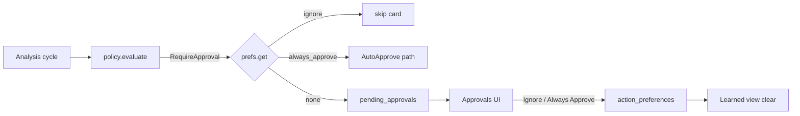

# AI_CONTEXT.md — Eir

## System Overview

Eir is a Rust/Tauri v2 Windows desktop agent: a LocalSystem service (`eir-svc`) diagnoses issues and runs repairs behind policy gates, while a medium-integrity tray UI (`eir-ui` + static `ui/`) renders status and sends commands over a mutually authenticated named pipe (`eir-proto` wire contract).

## Tech Stack & Architecture

- **Languages:** Rust 2021 (MSVC on Windows), static HTML/JS frontend (no npm/Vite).
- **Crates:** `eir-proto` (serde wire), `eir-svc` (service + SQLite audit), `eir-ui` (Tauri v2 tray).
- **Persistence:** SQLite via sqlx migrations under `migrations/`; config in `config.toml`.
- **Patterns:** decision loop with off-loop AI/executor workers; policy AutoApprove / RequireApproval / Block; conservative self-improvement (`learn/`); durable user action preferences (`prefs`).

## Component Map

- Wire: `eir-proto/src/lib.rs` — `StatusPayload`, `UiMsg`, `ApprovalInfo`, `ActionPreferenceView`, `LearnedFactView`, `UpdaterAppRow`.
- Service loop: `eir-svc/src/main.rs` — analysis routing, approval claims, `SetActionPreference` / `ClearActionPreference`, updater ignore.
- Preferences: `eir-svc/src/prefs.rs` + `migrations/0020_action_preferences.sql` — Ignore / Always Approve keyed by `FixAction::dedup_key`.
- Learning: `eir-svc/src/learn/` — detectors + `LearnedFacts::confidence_penalty(label, action_key)`; rejections store `action_key`.
- Policy: `eir-svc/src/policy/mod.rs`.
- UI: `ui/main.js`, `ui/index.html` — Approvals actions, Learned preferences list, Updates Available hide-on-ignore.
- Tray commands: `eir-ui/src/main.rs` — `set_action_preference`, `clear_action_preference`.

## Data Flow

1. Analysis proposes `FixAction` → confidence penalty from learned facts → policy verdict.
2. On `RequireApproval`, consult `action_preferences` by `dedup_key`: ignore skips; always_approve runs the AutoApprove path (rate limit + in-flight dedupe still apply).
3. UI Ignore/Always Approve writes preference, dismisses or executes the pending row; Learned `#pref-list` clears preferences.
4. Updater Ignore removes the app from `st.updater.apps` + persisted last-cycle status; Settings Unignore restores checking.

## Recent Context & Decisions

- **2026-09-06** — Cut v0.34.18: CLI-only providers (OpenCode/Claude/Codex/Cursor), Evergreen WebView2 (no fixed runtime; ~8 MB installer), OpenCode model list uses `opencode.cmd` instead of the Unix npm shim fallback of four fake models.
- **2026-09-06** — Packaging no longer embeds a fixed WebView2 runtime. NSIS uses `downloadBootstrapper` (Evergreen); portable relies on the same system runtime. `scripts/prepare-webview2.ps1` deleted; installer hooks still remove any leftover fixed-runtime tree on upgrade.
- **2026-09-06** — AI providers are CLI-only: OpenCode (`opencode`), Claude (`claude`), Codex (`codex`), Cursor (`agent`). HTTP Anthropic/OpenRouter/Ollama and the Kilo CLI are removed from `eir-svc`. Shared helpers live in `eir-svc/src/ai/cli_*.rs`; provider callers in `opencode_cli.rs`, `cursor_cli.rs`, `codex_cli.rs`, and `client.rs`.
- **2026-08-21** — Cut v0.34.17: Approvals Ignore / Always Approve, Updates Available hide-on-ignore, RejectedSignal action_key fix, Cargo `jobs = 0` removed for Rust 1.95 CI.
- **2026-08-21** — Approvals gained reversible Ignore and Always Approve (`action_preferences`). Updates Available hides ignored apps immediately. Learned kept and improved: rejection learning keys on `dedup_key`; Learned view hosts preference reverse-UI; empty-state copy clarifies automatic learning vs hard preferences.
